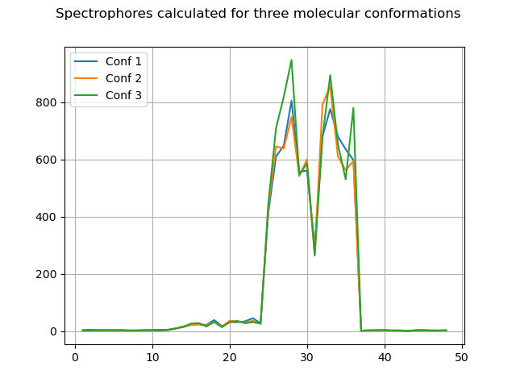
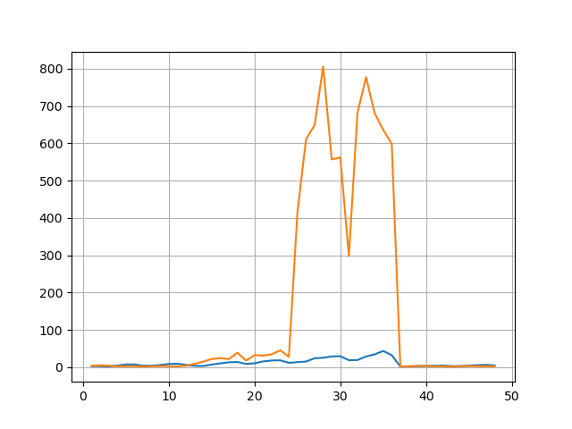
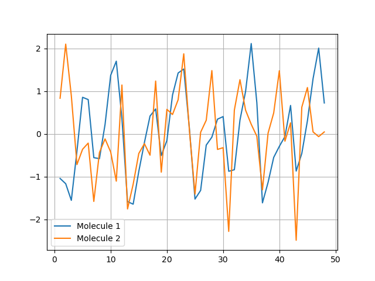
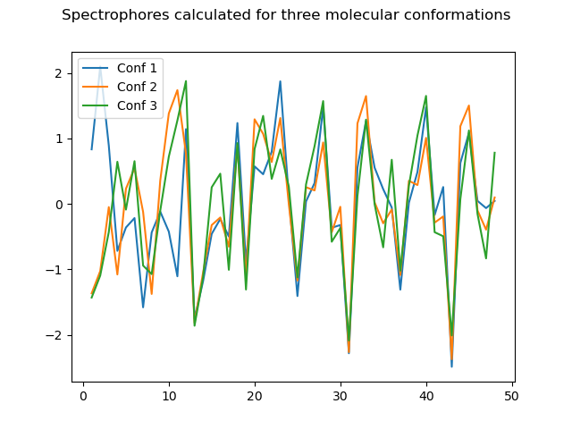

# Spectrophores

This module contains python code to calculate `spectrophores` from molecules. It is using the `RDKit` and `numba` toolkits.

The technology and its applications have been described in [*Journal of Cheminformatics* (2018) **10**, 9](https://jcheminf.biomedcentral.com/articles/10.1186/s13321-018-0268-9). The paper is also included in this distribution.


The `spectrophore` code can be used in two ways:
- As a standalone program to convert the molecules in a sd-file into their corresponding `spectrophores`;
- As a `python` module to import in your own `python` code.

In the following sections, both usages will be documented.


## Installation

#### 1. Installation of RDKit and Numba

We recommend to install both `RDKit` and `Numba` using `Anaconda`. If `conda` is not yet available on your system, you should install this first following the instructions on the [Anaconda website](https://docs.conda.io/projects/conda/en/latest/user-guide/install/#regular-installation). [`Numba`]() is an open source JIT compiler that translates a subset of Python and NumPy code into fast machine code. [`RDKit`](https://www.rdkit.org) is open source cheminformatics software that provides the code to work with molecules.

The easiest way to have everything installed is using `conda`. First create a suitable environment in which you will install the `spectrophore` technology:

```console
> conda create --name spectrophore python=3
```

This will install a new `conda` environment with Python 3.9 installed in it. Now activate this environment:

```console
> conda activate spectrophore
```

`Numba` and `rdkit` can now be installed as follows (make sure you first activated the `spectrophore` environment):

```console
> conda install numba
> conda install cudatoolkit
> conda install -c conda-forge rdkit
```

You can test the `rdkit` installation by opening a `python` session from your command-line (assuming you are still in the activated `spectrophore` environment) and typing the following:

```python
>>> from rdkit import Chem
>>> mol = Chem.MolFromSmiles("C1CCCC1")
>>> print(mol.GetNumAtoms())
5
```

Similarly, you can test the `numba` installation with this small `python` snippet:

```python
>>> import numba
>>> numba.__version__
'0.51.2'
```

With `numba -s` command you can also check whether you have a CUDA device installed (check for the section `__CUDA Information__`).

#### 2. Installing the spectrophore code

With the `spectrophore` environment still active, you can now easily install the `spectrophore` module using:

```console
> pip install uamc-spectrophore
```

Check the installation by opening a `python` session and entering:

```python
>>> from spectrophore import spectrophore
>>> spectrophore.__version__
'1.1.0'
```


## 1. Usage as a standalone program

After installation, one should be able to use the `spectrophore.py` code as a standalone program to calculated `spectrophores` from a sd-file with molecules. You can find out where `spectrophore.py` is located by starting a `python` shell and typing:

```python
>>> from spectrophore import spectrophore
>>> spectrophore.__file__
'/Users/hans/anaconda3/envs/spectrophore/lib/python3.8/site-packages/spectrophore/spectrophore.py'
````

Either you can use this full path to call the `spectrophore.py` code, or you can add it to your $PATH environment variable.

To use `spectrophore.py`, type the following on the command-line:

```console
> spectrophore.py -h
```

This will provide you with all details on how to calculate `spectrophores` from a sd-file:

```console
usage: spectrophore.py [-h] [-n {none,mean,all,std}] [-s {none,unique,mirror,all}] [-a {1,2,3,4,5,6,9,10,12,15,18,20,30,36,45,60,90,180}]
                       [-r RESOLUTION] [-p MAX_WORKERS] -i INFILE -o OUTFILE

Calculate spectrophores

optional arguments:
  -h, --help            show this help message and exit
  -n {none,mean,all,std}, --norm {none,mean,all,std}
                        normalization setting (default: all)
  -s {none,unique,mirror,all}, --stereo {none,unique,mirror,all}
                        stereo setting (default: none)
  -a {1,2,3,4,5,6,9,10,12,15,18,20,30,36,45,60,90,180}, --accuracy {1,2,3,4,5,6,9,10,12,15,18,20,30,36,45,60,90,180}
                        accuracy setting (default: 20)
  -r RESOLUTION, --resolution RESOLUTION
                        resolution setting (>0) (default: 3)
  -p MAX_WORKERS, --np MAX_WORKERS
                        number of processors to use; -1 is all processors (default: -1)

required arguments:
  -i INFILE, --in INFILE
                        input sdf file (default: None)
  -o OUTFILE, --out OUTFILE
                        output spectrophore file (default: None)
```


## 2. Usage as a `python` module

### 2.1. Introduction

Once you have installed all required tools and the `uamc-spectrophore` package, you are ready to use the tool. In its most simple form, `spectrophores` can be calculated as follows:

```python
>>> from spectrophore import spectrophore
>>> from rdkit import Chem
>>> from rdkit.Chem import AllChem
>>> mol = Chem.MolFromSmiles("c1ncncc1")
>>> mol = Chem.AddHs(mol)
>>> AllChem.EmbedMolecule(mol, randomSeed=1)
0
>>> calculator = spectrophore.SpectrophoreCalculator(normalization='none')
Probes initialised: 48 number of probes in total
12 probes are used due to the imposed stereo flag
>>> calculator.calculate(mol)
array([  1.40924502,   2.02165046,   1.60116436,   3.03469596,
         2.41507857,   5.08722611,   2.28581149,   1.72504948,
         3.43664362,   3.98129377,   5.09220782,   2.98450003,
         0.64177653,   0.80248703,   4.87071751,   4.87075576,
         2.87898807,   4.10470357,   1.94134559,   3.59602651,
         4.90197306,   4.13912579,   4.53947967,   5.76613547,
        44.7911691 ,  71.551798  , 106.82237198, 106.82056914,
        49.73713312,  61.66294048,  23.50814953,  81.88458225,
        77.47027889,  67.52201764,  57.44200226, 112.96883394,
         0.67946222,   1.16072246,   2.47007244,   2.47010285,
         1.02031206,   1.14833662,   0.51142376,   1.74329957,
         1.80947322,   1.30153977,   1.24314761,   2.51634169])
```

In the example shown, the first three lines import the required modules: module `spectrophore` for the calculation of spectrophores, module `Chem` to generate a RDKit molecule from a smiles string, and module `AllChem` to generate a 3D-conformation from the molecule. Next, a molecule is created from a smiles string (line 4), and a conformation is then generated at the 6'th line after adding hydrogen atoms on the 5'th line. Finally, on lines 7 and 8, a  `SpectrophoreCalculator` object is generated and this object is then used to calculate a `spectrophore` descriptor (line 8), which consists in its default form of 4 * 12 numbers.

> Note: a few words on the shape of a `spectrophore`:
>
> Each `spectrophore` consists of a set of floating point numbers, and this set is always a multiple of 4. The actual number count depends on how stereochemistry is treated in the calculation of spectrophores; this is controlled by the `stereo()` method:
- `stereo("none")`: the total number of numbers in a `spectrophore` is 48 (4 * 12; default),
- `stereo("unique")`: the total number of numbers in a `spectrophore` is 72 (4 * 18),
- `stereo("mirror")`: the total number of numbers in a `spectrophore` is 72 (4 * 18),
- `stereo("all")`: the total number of numbers in a `spectrophore` is 144 (4 * 36).
>
> Whatever the actual number of `spectrophore` points, these are always calculated according the same atomic properties. For example, consider a `spectrophore` of 4*n* points, then these points represent the following:
- **Points 1 to *n***: representing the interaction energies between the **atomic partial charges** and each of the *n* boxes;
- **Points *n*+1 to 2*n***: representing the interaction energies between the **atomic lipophilicities** and each of the *n* boxes;
- **Points 2*n*+1 to 3*n***: representing the interaction energies between the **atomic shape deviations** and each of the *n* boxes;
- **Points 3*n*+1 to 4*n***: representing the interaction energies between the **atomic electrophilicities** and each of the *n* boxes.
>
> Please have a look at the original publication form more information about the way these interaction energies are calculated, and what the `stereo()` method actually means.

If a molecule contains more than one 3D-conformation, then one may specify which conformation should be used for the calculation of `spectrophores`. As an example, consider the following code:

```python
>>> calculator = spectrophore.SpectrophoreCalculator(normalization='none')
Probes initialised: 48 number of probes in total
12 probes are used due to the imposed stereo flag
>>> aspirin = Chem.MolFromSmiles("CC(Oc1ccccc1C(O)=O)=O")
>>> mol = Chem.AddHs(mol)
>>> cids = AllChem.EmbedMultipleConfs(aspirin, numConfs=3, randomSeed=1)
>>> print(len(cids))
3
>>> for i in range(len(cids)): calculator.calculate(aspirin, i)
...
array([  2.96462985,   3.10789424,   2.92701307,   4.73480129,
         7.50700756,   6.7752696 ,   4.69460938,   4.98432913,
         6.56649102,   8.24607551,  10.16534187,   6.63522774,
         4.85850723,   8.00209372,   6.81008801,   8.81632779,
        15.71507174,  19.57181297,  10.92897534,  14.39582906,
        17.00322879,  18.44783421,  25.71436069,  15.14679154,
        72.95486358,  98.34447259, 169.3500435 , 182.39792935,
       131.36937557, 131.15881671,  65.37049347, 130.03636659,
       162.26216635, 149.89674859, 179.36647984, 198.56950862,
         2.24635125,   3.15646299,   5.16635242,   5.61258427,
         4.05891392,   4.40971427,   2.20378948,   4.40347814,
         4.95831891,   5.23932504,   5.46180745,   6.26469512])
array([  2.86370938,   3.11908114,   2.9662985 ,   4.77096845,
         7.39310395,   7.31580198,   4.90127635,   5.10262032,
         6.54896831,   8.57209314,  10.4252182 ,   6.48236019,
         4.78703499,   8.0880778 ,   6.63117671,   8.7416472 ,
        16.06779332,  19.49238064,  10.81952934,  14.26088777,
        16.78952893,  18.33067086,  25.61064224,  14.16513261,
        69.21313429,  96.67400647, 170.67855437, 184.54777123,
       119.22878554, 135.03753518,  59.88890451, 119.4956808 ,
       173.35099255, 145.16651515, 180.47798998, 187.6085509 ,
         2.19625495,   3.10844742,   5.21008164,   5.67473542,
         3.85068934,   4.43502882,   2.10609961,   4.09882807,
         5.17161401,   5.10314635,   5.38430731,   5.95512953])
array([  3.03098509,   3.43547073,   2.87682353,   4.70654369,
         7.55577361,   6.44795641,   4.55689165,   4.95357717,
         6.48715747,   8.70650427,   8.51842619,   6.36629528,
         4.92845349,   9.35540521,   6.61796667,   8.52382953,
        15.45974411,  19.28477464,  10.79250878,  13.99183075,
        16.79567856,  18.5976027 ,  24.08439853,  13.11722779,
        77.63923352, 120.10923123, 169.49598685, 166.18620528,
       131.14177781, 144.46258022,  72.46953874, 149.309445  ,
       140.3545568 , 155.59245541, 130.84980794, 174.86938246,
         2.44134022,   3.88011509,   5.14895684,   4.83463651,
         4.07958148,   4.01362515,   2.4914236 ,   4.58399527,
         4.27013576,   5.33584991,   4.63150519,   5.6371141 ])
```

One can easily visualise `spectrophores` by plotting the actual values. For example, consider the following snippet:

```python
>>> import matplotlib.pyplot as plt
>>> mol = Chem.MolFromSmiles("CC(CCC1=CC=CC=C1Cl)N1CCOCC1")
>>> mol = Chem.AddHs(mol)
>>> cids = AllChem.EmbedMultipleConfs(mol, numConfs = 10, randomSeed = 1)
>>> spectrophores = []
>>> for cid in cids: spectrophores.append(calculator.calculate(mol, cid))
...
>>> for i in range(3): plt.plot(range(1,49), spectrophores[i], label='Conf %d' % (i+1))
...
[<matplotlib.lines.Line2D object at 0x7faf42154be0>]
[<matplotlib.lines.Line2D object at 0x7faf420db880>]
[<matplotlib.lines.Line2D object at 0x7faf420df5e0>]
>>> plt.legend(loc='upper left')
>>> plt.grid()
>>> plt.suptitle("Spectrophores calculated for three molecular conformations")
>>> plt.savefig("spectrophore/images/exampleplot1.png")
```

which generates the following plot:



Similarly, one can easily compare the `spectrophores` from two different molecules, and quantify the difference:

```python
>>> plt.close()
>>> spectrophores = []
>>> mols = [Chem.MolFromSmiles("ClC(Br)(I)F"), Chem.MolFromSmiles("CC(CCC1=CC=CC=C1Cl)N1CCOCC1")]
>>> for i in range(2):
...    mols[i] = Chem.AddHs(mols[i])
...    AllChem.EmbedMolecule(mols[i], randomSeed=1)
...    spectrophores.append(calculator.calculate(mols[i]))
...
0
0
>>> for i in range(2): plt.plot(range(1,49), spectrophores[i], label='Molecule %d' % (i+1))
...
[<matplotlib.lines.Line2D object at 0x7faf420df520>]
[<matplotlib.lines.Line2D object at 0x7faf420df4c0>]
>>> plt.grid()
>>> plt.savefig("spectrophore/images/exampleplot2.png")
>>> from scipy.spatial import distance
>>> distance.euclidean(spectrophores[0],spectrophores[1])
2060.6541853196104
```



From the last example, it is clear that the actual `spectrophore` values may differ a lot depending on the type of molecule. Also, the absolute values are depending on the property type, with some properties leading to large values (e.g. shape deviation) and others very small. For this reason, a number of normalisation methods are provided as shown below.


### 2.2. Module methods

#### `resolution()`

The `resolution()` method controls the smallest distance between the molecule and the surrounding box. By default this value is set to 3.0 A. The `resolution()` can be specified at the moment of class creation, or later on using the `resolution()` method:

```python
>>> mol = Chem.MolFromSmiles("ClC(Br)(I)F")
>>> AllChem.EmbedMolecule(mol, randomSeed=1)
0
>>> calculator = spectrophore.SpectrophoreCalculator(normalization='none')  # Default of 3.0
Probes initialised: 48 number of probes in total
12 probes are used due to the imposed stereo flag
>>> print(calculator.calculate(mol)[0])
2.986999574231686
>>> calculator = spectrophore.SpectrophoreCalculator(normalization='none', resolution = 3.0)
Probes initialised: 48 number of probes in total
12 probes are used due to the imposed stereo flag
>>> print(calculator.calculate(mol)[0])
2.986999574231686
>>> calculator = spectrophore.SpectrophoreCalculator(normalization='none', resolution = 5.0)
Probes initialised: 48 number of probes in total
12 probes are used due to the imposed stereo flag
>>> print(calculator.calculate(mol)[0])
1.3418808308942443
>>> calculator.resolution(10.0)
>>> print(calculator.calculate(mol)[0])
0.33471846966269136
```

The larger the resolution value (e.g. 10.0 *versus* 3.0 A), the smaller the interaction energies and corresponding `spectrophore` values.

Calling the `resolution()` method without an argument returns the current resolution value:

```python
>>> calculator.resolution()
10.0
```


#### `accuracy()`

The `accuracy()` method controls the angular stepsize by which the molecule is rotated within the cages. By default this value is set to 20°. This parameter can be modified either at class creation, or using the `accuracy()` method later on. The accuracy should be an integer fraction of 180, hence 180 modulus *accuracy* should be equal to 0. The smaller the accuracy value (meaning smaller angular stepsizes), the longer the computation time:

```python
>>> calculator = spectrophore.SpectrophoreCalculator(accuracy = 20.0, normalization = 'none') # Default
Probes initialised: 48 number of probes in total
12 probes are used due to the imposed stereo flag
>>> print(calculator.calculate(mol)[0])
2.986999574231686
>>> calculator = spectrophore.SpectrophoreCalculator(normalization = 'none')
Probes initialised: 48 number of probes in total
12 probes are used due to the imposed stereo flag
>>> print(calculator.calculate(mol)[0])
2.986999574231686
>>> calculator = spectrophore.SpectrophoreCalculator(accuracy = 2.0, normalization = 'none')
Probes initialised: 48 number of probes in total
Only using 12 probes
>>> print(calculator.calculate(mol)[0])
3.031550037295078
>>> 100.0 * (3.031550037295078 - 2.986999574231686) / 3.031550037295078
1.469560538843759
```

Calling the `accuracy()` method without an argument returns the current accuracy value:

```python
>>> calculator.accuracy()
2
```


#### `normalization()`

With the `normalization()` method, one can specify the type of `spectrophore` normalization. There are four possibilities:
- `normalization("none")`: no normalization is applied and the `spectrophore` values are the raw calculated interaction energies (multiplied by -100),
- `normalization("mean")`: for each property, the average value is calculated and each of the individual `spectrophore` property value are reduced by these mean values. This centers the calculated values around 0,
- `normalization("std")`: for each property, the standard deviation is calculated and each of the individual `spectrophore` property value is divided by these standard deviations,
- `normalization("all")`: each spectrophore value is normalized by mean and standard deviation. This is the fefault option.

The default value is "all".

```python
>>> calculator.accuracy(20)
>>> calculator.normalization("none")
>>> spec = calculator.calculate(mol)
>>> print(spec[:12])
[2.98699957 2.70232233 1.80297059 4.46890589 7.37554531 7.25227472
 4.11233399 4.05599379 5.90845924 8.56495646 9.32825451 6.22968839]
>>> sum(spec[:12])
64.78870479507654
>>> calculator.normalization("mean")
>>> spec = calculator.calculate(mol)
>>> print(spec[:12])
[-2.41205916 -2.69673641 -3.59608814 -0.93015285  1.97648657  1.85321599
 -1.28672475 -1.34306494  0.5094005   3.16589773  3.92919578  0.83062966]
>>> sum(spec[:12])
-1.7763568394002505e-15
>>> calculator.normalization("std")
>>> spec = calculator.calculate(mol)
>>> print(spec[:12])
[1.2924119  1.16923804 0.78010746 1.9336016  3.19124336 3.13790677
 1.77932044 1.75494322 2.55646607 3.70587655 4.03613957 2.69545517]
>>> sum(spec[:12])
28.03271016057212
>>> calculator.normalization("all")
>>> spec = calculator.calculate(mol)
>>> print(spec[:12])
[-1.04364728 -1.16682114 -1.55595172 -0.40245758  0.85518418  0.80184759
 -0.55673874 -0.58111596  0.22040689  1.36981737  1.70008039  0.35939599]
>>> sum(spec[:12])
0.0
```

Using a normalization over 'all' makes it more easier to compare `spectrophores`  between molecules:

```python
>>> plt.close()
>>> mols = [Chem.MolFromSmiles("ClC(Br)(I)F"), Chem.MolFromSmiles("CC(CCC1=CC=CC=C1Cl)N1CCOCC1")]
>>> spectrophores = []
>>> for i in range(2):
...    mols[i] = Chem.AddHs(mols[i])
...    AllChem.EmbedMolecule(mols[i], randomSeed = 1)
...    spectrophores.append(calculator.calculate(mols[i]))
...
0
0
>>> for i in range(2): plt.plot(range(1,49), spectrophores[i], label='Molecule %d' % (i+1))
...
[<matplotlib.lines.Line2D object at 0x7faf420df520>]
[<matplotlib.lines.Line2D object at 0x7faf420df4c0>]
>>> plt.legend()
>>> plt.grid()
>>> plt.savefig("spectrophore/images/exampleplot3.png")
>>> from scipy.spatial import distance
>>> distance.euclidean(spectrophores[0],spectrophores[1])
8.374486663568376
```



The same holds true when comparing `spectrophores` from different conformations:

```python
>>> plt.close()
>>> spectrophores = []
>>> mol = Chem.MolFromSmiles("CC(CCC1=CC=CC=C1Cl)N1CCOCC1")
>>> mol = Chem.AddHs(mol)
>>> cids = AllChem.EmbedMultipleConfs(mol, numConfs = 10, randomSeed = 1)
>>> calculator.normalization("all")
>>> for cid in cids: spectrophores.append(calculator.calculate(mol, cid))
...
>>> for i in range(3): plt.plot(range(1,49), spectrophores[i], label='Conf %d' % (i+1))
...
[<matplotlib.lines.Line2D object at 0x7faf42154be0>]
[<matplotlib.lines.Line2D object at 0x7faf420db880>]
[<matplotlib.lines.Line2D object at 0x7faf420df5e0>]
>>> plt.legend(loc='upper left')
>>> plt.suptitle("Spectrophores calculated for three molecular conformations")
>>> plt.savefig("spectrophore/images/exampleplot4.png")
>>> from scipy.spatial import distance
>>> distance.euclidean(spectrophores[0],spectrophores[1])
5.974719598137992
>>> distance.euclidean(spectrophores[0],spectrophores[2])
6.081919289368958
>>> distance.euclidean(spectrophores[1],spectrophores[2])
3.7508923029079013
```




#### `stereo()`

The `stereo()` method specifies the kind of cages to be used. The reason for this is that some of the cages that are used to calculate `spectrophores` have a stereospecific distribution of the interaction points:


There are four possibilities:
- `stereo("none")`: no stereospecificity (default). `Spectrophores` are generated using cages that are not stereospecific. For most applications, these `spectrophores` will suffice,
- `stereo("unique")`: unique stereospecificity. `Spectrophores` are generated using unique stereospecific cages,
- `stereo("mirror")`: mirror stereospecificity. Mirror stereospecific `spectrophores` are `spectrophores` resulting from the mirror enantiomeric form of the input molecules,
- `stereo("all")`: all cages are used. This results in the longest `spectrophores` and should only in specific cases be used.

The differences between the corresponding data points of unique and mirror stereospecific `spectrophores` are very small and require very long calculation times to obtain a sufficiently high quality level. This increased quality level is triggered by the `accuracy` setting and will result in calculation times being increased by at least a factor 100. As a consequence, it is recommended to apply this increased accuracy only in combination with a limited number of molecules, and when the small differences between the stereospecific `spectrophores` are really critical. However, for the vast majority of virtual screening applications, this increased accuracy is not required as long as it is not the intention to draw conclusions about differences in the underlying molecular stereoselectivity. Non-stereospecific `spectrophores` will therefore suffice for most applications.


## 3. Interpreting `spectrophores`

A `spectrophore` is a vector of real number and has a certain length. The length depends on the used `stereo` method and the number of properties. The standard setting uses a set of non-stereospecific probes in combination with four properties:
- property 1: atomic partial charges
- property 2: atomic lipophilicities
- property 3: atomic shape deviations
- property 4: atomic electrophilicties

The combination of four properties and the set of non-stereospecific probes leads to a `spectrophore` vector length of 48. The use of other probes leads to other vector lengths, as summarised in this table:

| Stereospecificity | Number of probes | Number of properties | Length |
| ----------------- |:----------------:|:--------------------:|:------:|
| none              | 12               | 4                    | 48     |
| unique            | 18               | 4                    | 72     |
| mirror            | 18               | 4                    | 72     |
| all               | 36               | 4                    | 144    |

The general layout of a `spectrophore`, irrespective of its length, is always:

| Property 1         | Property 2         |         Property 3 |         Property 4 |
|:------------------:|:------------------:|:------------------:|:------------------:|
| probe 1..probe *n* | probe 1..probe *n* | probe 1..probe *n* | probe 1..probe *n* |

meaning that the first *n* values (with *n* being the number of probes) are calculated using property 1 (partial charges), then another *n* values (*n*+1 up to 2*n*) calculated using property 2 (lipophilicities), and so forth.


## 4. Release updates

- 1.0.1: First official release on PyPi

- 1.1.0:
    - Updated and optimised the NumPy code
    - Bug fixes
    - Introduced Numba
    - Made the 'all' normalization method the default one
    - Added a test suite 


## 5. Reference and citation

If you use the `spectrophore` technology in your own research work, please cite as follows:

Gladysz, R.; Mendes Dos Santos, F.; Langenaeker, W.;  Thijs, G.; Augustyns, K.; De Winter, H. (2018) 'Spectrophores as one-dimensional descriptors calculated from three-dimensional atomic properties: applications ranging from scaffold hopping to multi-target virtual screening', *J. Cheminformatics* **10**, 9.
